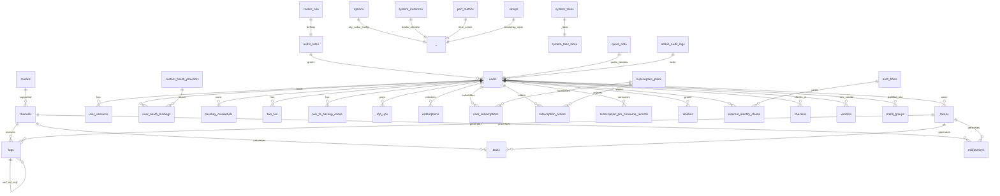

# 豫鑫 API 数据库 ER 速览

> 自动生成于 2026-08-03，基于 `docs/schema.sql`。
> 关系图（Mermaid）供运维 / DBA / 二次开发参考，正式生产变更前请以最新 schema 为准。

## 表清单（35 张）

| 类别 | 表名 | 用途 |
|---|---|---|
| 用户 | users | 主用户表（bcrypt 密码、邮箱、OAuth ID、邀请、Stripe 客户 ID、auth_version）|
| 鉴权 | user_sessions | 登录会话控制面（设备/IP/到期/撤销）|
| 鉴权 | auth_flows | AuthFlow 流程（密码重置 / OAuth bind）临时记录 |
| 鉴权 | external_identity_claims | OAuth/Email/Telegram 绑定的外部身份声明 |
| 鉴权 | passkey_credentials | WebAuthn Passkey 凭据 |
| 鉴权 | two_fas / two_fa_backup_codes | 2FA 因子与备份码 |
| 鉴权 | user_oauth_bindings | OAuth provider ↔ user 绑定关系 |
| 鉴权 | abilities | RBAC 授权位（管理员/普通用户）|
| 鉴权 | authz_roles / casbin_rule | Casbin RBAC 角色与策略 |
| API Key | tokens | 用户 API Token（明文 key，**生产需加密**，见 R1 整改）|
| 渠道 | channels | 上游 LLM 渠道配置（**key 明文存**，见 R1 整改）|
| 渠道 | models | 支持的模型清单与映射 |
| 渠道 | vendors | 多租户 / 多 vendor 元数据 |
| 渠道 | prefill_groups | 渠道预填分组 |
| 计费 | quota_data | 用户配额窗口（quota/used_quota）|
| 计费 | top_ups | 充值记录 |
| 计费 | redemptions | 兑换码 |
| 计费 | subscription_plans | 订阅套餐 |
| 计费 | subscription_orders | 订阅订单 |
| 计费 | user_subscriptions | 用户当前订阅 |
| 计费 | subscription_pre_consume_records | 预扣使用记录 |
| 日志 | logs | 主调用日志（已建 11 个索引）|
| 任务 | tasks | 异步任务（视频/图片生成等）|
| 任务 | midjourneys | Midjourney 任务专用表 |
| 系统 | options | KV 配置（系统运行参数）|
| 系统 | setups | 初始化状态（是否 root_init）|
| 系统 | system_tasks / system_task_locks | 后台任务与分布式锁 |
| 系统 | system_instances | 集群 leader 选举 |
| 系统 | perf_metrics | 性能时序指标 |
| 系统 | checkins | 每日签到 |
| 系统 | admin_audit_logs | 管理员审计日志 |
| 系统 | custom_oauth_providers | 自定义 OAuth provider 配置 |
